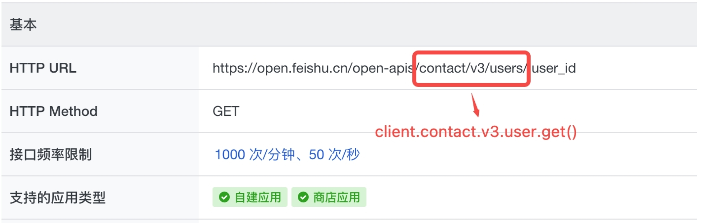

# 飞书开放接口 SDK
为帮助开发者更加便捷地使用飞书开放能力开发应用，简化在接入飞书开放平台时的操作步骤，开放平台提供了统一的服务端 SDK。开发者可使用 SDK，快捷地开发功能，提升开发效率。

## 安装
```shell
pip install lark-oapi -U
```
支持 Python 3.8 及以上

## 简单示例
```python
import lark_oapi as lark

# 创建client
client = lark.Client.builder().app_id("APP_ID").app_secret("APP_SECRET").build()

# 构造请求对象
request = lark.contact.v3.GetUserRequest.builder().user_id("7be5fg9a").build()

# 发起请求
response = client.contact.v3.user.get(request)
```
更多示例可参考：[请求示例](./samples/api)

## API Client
开发者在调用 API 前，需要先创建一个 API Client，然后才可以基于 API Client 发起 API 调用。

### 创建 Client
- 自建应用
```python
import lark_oapi as lark

client = lark.Client.builder() \
    .app_id("APP_ID") \
    .app_secret("APP_SECRET") \
    .build()
```

- 商店应用
```python
import lark_oapi as lark

client = lark.Client.builder() \
    .app_id("APP_ID") \
    .app_secret("APP_SECRET") \
    .app_type(lark.AppType.ISV) \
    .build()
```

### Client 配置项
创建 API Client 时，可以对 API Client 进行一定的配置，比如我们可以在创建 API Client 时设置日志级别、http 请求超时时间等。

```python
import lark_oapi as lark

client = lark.Client.builder() \
    .app_id("APP_ID") \
    .app_secret("APP_SECRET") \
    .domain(lark.FEISHU_DOMAIN) \       # 域名, 默认为 https://open.feishu.cn
    .timeout(3) \                       # 客户端超时时间, 单位秒, 默认永不超时
    .app_type(lark.AppType.ISV) \       # 应用类型, 默认为自建应用; 若设为 ISV 需在 request_option 中配置 tenant_key
    .app_ticket("xxxx") \               # 获取 app_access_token 凭证, app_type = ISV 时需配置
    .enable_set_token(False) \          # 是否允许手动设置 token, 默认不开启; 开启后需在 request_option 中配置 token
    .cache(Cache()) \                   # 自定义缓存, 默认使用预置的本地缓存
    .log_level(lark.LogLevel.DEBUG) \   # 日志级别, 默认为 WARNING
    .build()
```

## API 调用
创建完 API Client 后，我们可以使用 ``client.业务域.版本.资源.方法名称`` 来定位具体的 API 方法，然后对具体的 API 发起调用。



飞书开放平台开放的所有 API
列表，可点击[这里查看](https://open.feishu.cn/document/ukTMukTMukTM/uYTM5UjL2ETO14iNxkTN/server-api-list)

### 基本用法
如下示例，我们通过 client 调用 [通过手机号或邮箱获取用户 ID](https://open.feishu.cn/document/server-docs/contact-v3/user/batch_get_id) 接口。

```python
# Code generated by Lark OpenAPI.

import lark_oapi as lark
from lark_oapi.api.contact.v3 import *


client = lark.Client.builder() \
    .app_id("APP_ID") \
    .app_secret("APP_SECRET") \
    .log_level(lark.LogLevel.DEBUG) \
    .build()

# 构造请求对象
request: BatchGetIdUserRequest = BatchGetIdUserRequest.builder() \
    .user_id_type("open_id") \
    .request_body(BatchGetIdUserRequestBody.builder()
                  .emails(["xxxx@bytedance.com"])
                  .mobiles(["15000000000"])
                  .build()) \
    .build()

# 发起请求
response: BatchGetIdUserResponse = client.contact.v3.user.batch_get_id(request)

# 处理失败返回
if not response.success():
    lark.logger.error(
        f"client.contact.v3.user.batch_get_id failed, code: {response.code}, msg: {response.msg}, log_id: {response.get_log_id()}")

# 处理业务结果
lark.logger.info(lark.JSON.marshal(response.data, indent=4))
```
更多示例可参考：[请求示例](./samples/api)

### Request 配置项
在每次发起 API 调用时，可以设置请求级别的一些参数，比如传递 userAccessToken, 自定义 headers 等。

```python
import lark_oapi as lark
from lark_oapi.api.contact.v3 import *

# 创建client
import lark_oapi as lark
from lark_oapi.api.contact.v3 import *

# 创建client
client = lark.Client.builder() \
    .enable_set_token(True) \
    .log_level(lark.LogLevel.DEBUG) \
    .build()

# 构造请求对象
request: BatchGetIdUserRequest = BatchGetIdUserRequest.builder() \
    .user_id_type("open_id") \
    .request_body(BatchGetIdUserRequestBody.builder()
                  .emails(["xxxx@bytedance.com"])
                  .mobiles(["15000000000"])
                  .build()) \
    .build()

# 设置请求选项
headers = {"key1": "value1", "key2": "value2"}
req_opt = lark.RequestOption.builder()\
    .tenant_access_token("t-g1047hjTXIZKCBFYWXUCK3D2LJWZYCWYL7USXXXX")\
    .headers(headers)\
    .build()

# 发起请求
response: BatchGetIdUserResponse = client.contact.v3.user.batch_get_id(request, req_opt)

# 处理失败返回
if not response.success():
    lark.logger.error(
        f"client.contact.v3.user.batch_get_id failed, code: {response.code}, msg: {response.msg}, log_id: {response.get_log_id()}")

# 处理业务结果
lark.logger.info(lark.JSON.marshal(response.data, indent=4))
```

如上使用 RequestOptions 的 Builder 模式构建请求级别的参数。如下表格，展示了所有可设置的选项：

<table>
  <thead align=left>
    <tr>
      <th>
        配置选项
      </th>
       <th>
        描述
      </th>
    </tr>
  </thead>
  <tbody align=left valign=top>
    <tr>
      <th>
        <code>tenant_key</code>
      </th>
      <td>租户 key, 商店应用必须设置该选项。</td>
    </tr>
    <tr>
      <th>
        <code>user_access_token</code>
      </th>
      <td>用户 token，创建 Client 时 enable_set_token 需要设置为 True。</td>
    </tr>
    <tr>
      <th>
        <code>tenant_access_token</code>
      </th>
      <td>租户 token，创建 Client 时 enable_set_token 需要设置为 True。</td>
    </tr>
    <tr>
      <th>
        <code>app_access_token</code>
      </th>
      <td>应用 token，创建 Client 时 enable_set_token 需要设置为 True。</td>
    </tr>
    <tr>
      <th>
        <code>headers</code>
      </th>
      <td>自定义请求头，这些请求头会被透传到飞书开放平台服务端。</td
    </tr>
  </tbody>
</table>

### 原生方式调用
部分老版本接口，由于没有元数据信息，所以无法生成对应的 SDK 模型，需要使用原生方式调用。

如下示例，使用 client 原生方式同样调用 [通过手机号或邮箱获取用户 ID](https://open.feishu.cn/document/server-docs/contact-v3/user/batch_get_id) 接口。

```python
import lark_oapi as lark


# 创建client
client = lark.Client.builder() \
    .app_id("APP_ID") \
    .app_secret("APP_SECRET") \
    .log_level(lark.LogLevel.DEBUG) \
    .build()

# 构造请求对象
request: lark.BaseRequest = lark.BaseRequest.builder() \
    .http_method(lark.HttpMethod.POST) \
    .uri("/open-apis/contact/v3/users/batch_get_id") \
    .token_types({lark.AccessTokenType.TENANT}) \
    .queries([("user_id_type", "open_id")]) \
    .body({"emails": ["xxxx@bytedance.com"], "mobiles": ["15000000000"]}) \
    .build()

# 发起请求
response: lark.BaseResponse = client.request(request)

# 处理失败返回
if not response.success():
    lark.logger.error(
        f"client.request failed, code: {response.code}, msg: {response.msg}, log_id: {response.get_log_id()}")

# 处理业务结果
lark.logger.info(str(response.raw.content, lark.UTF_8))
```
更多示例可参考：[原生调用](samples/api/raw.py)

## License
MIT

## 加入讨论群
[_单击_](https://applink.feishu.cn/client/chat/chatter/add_by_link?link_token=575k28fa-2c12-400a-80c0-2d8924e00d38)或扫码加入讨论群


